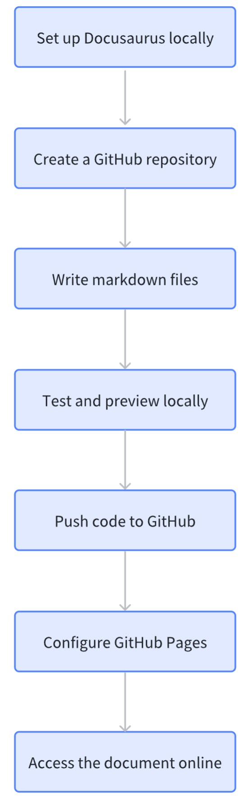
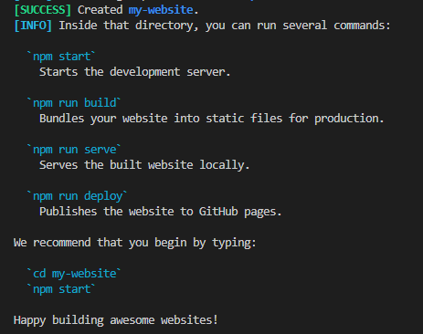
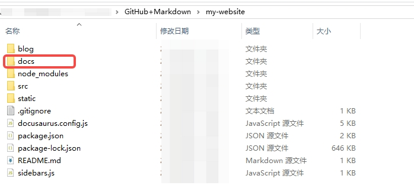
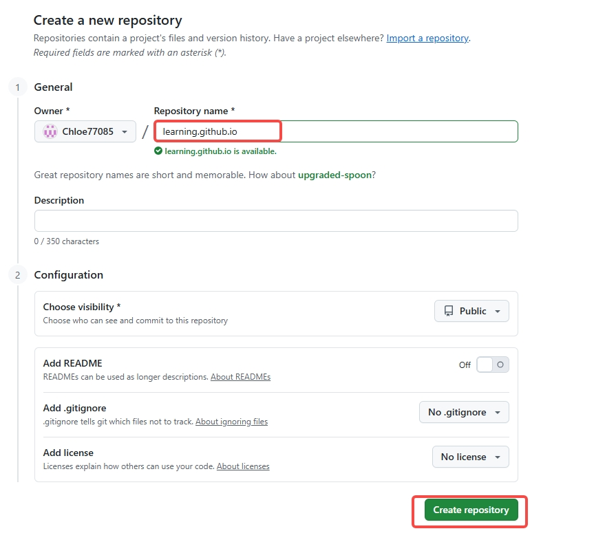
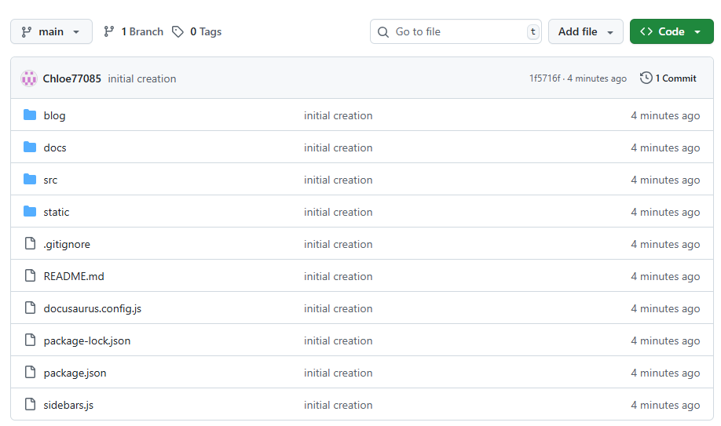

# GitHub Pages + Docusaurus

This document illustrates how to create a project, write markdown files, manage markdown files on GitHub, and use Docusaurus for compilation and preview. 

## Concepts

- **VS Code**
  
  Visual Studio Code (VS Code) is a free, open-source, lightweight, and powerful source code editor developed by Microsoft.
- **Markdown**
  
  Markdown is a lightweight markup language for creating formatted text using a plain-text editor. The markdown syntax you will need to follow when writing a markdown file are listed in the Markdown syntax section.
- **GitHub Pages**
  
  GitHub Pages is a free static site hosting service provided directly by GitHub.
- **Docusaurus**
  
  Docusaurus is a modern, static site generator (SSG) designed specifically and primarily for building documentation websites. It is a powerful open-source framework that takes your content (written in Markdown) and a configuration file, and turns it into a fast, search engine optimization (SEO)-friendly, and full-featured documentation site.

The flowchart of using this combo is as follows: 




## Preparation

1. Install [VS code](https://code.visualstudio.com/), [Git](https://git-scm.com/), and [Node.js](https://nodejs.org/zh-cn).
   
2. Run the following commands. If the versions are returned, it indicates that Node.js is properly installed.
   ```
   node -v
   npm -v
   ```
3. Run `git --version`. If the version is returned, it indicates that Git is properly installed.
    :::note
     It is recommended that you install the following extensions in VS Code:
     - **Code Spell Checker**: helps you identify spell errors when you write documents.
     - **Markdown Preview Enhanced**: previews the document in VS Code.
    :::

## Create a Docusaurus project

Perform the following steps to create a Docusaurus project:
1. Create a folder to store all markdown and related configuration files of the project you want to create. For example, create folder *Git + Markdown*.
2. In VS Code, open the folder you created.
3. Open a new terminal and run `npx create-docusaurus@latest my-website classic` to create a Docusaurus site under the folder you created.
   If the output is as follows, it indicates that the site is created successfully.

   
4. A new folder named *my-website* and other files and folders in the following figure will be generated under the folder you created.
   
   

     :::warning
     When the *my-website* folder is generated, an *Intro.md* file is generated. Do not delete this file. Otherwise, you will fail in the build step.
     :::
   
    - Save all the markdown files to *my-website* -> *docs*. 
  
    - Under *my-website* -> *docs*, create a folder named *images* and save all the image files you will use to it.

5. Write the markdown files in VS Code. For the markdown formats you need to follow, refer to the following [Markdown syntax](#markdown-syntax) section.

     :::tip
     **Markdown syntax**

     - **Ordered list**: Use a number and a period to organize the items for ordered lists.
     - **Unordered list**: Use an asterisk (*) or hyphen (-) to organize the items for unordered lists.
     - **Bold**: Use double asterisks (**) before and after the content you want to bold.
     - **Italic**: Use a single asterisk (*) before and after the content you want to italicize.
     - **Code**: Use a single backtick (`) before and after code in text.
     - **Code block**: Use three backticks (```) before and after a code block.
     - **Image**: Insert pictures in the `` format.
   
          Use this format when the *images* folder is in the same level of directory as the markdown file you are writing. 
          When the pictures you want to insert is in a higher level of directory, use two periods before */* to find the folder. For example, `` . When you input *./* or *../*, the folders in the directory are automatically prompted for your selection.
     - **External hyperlink**: Insert external hyperlinks in the `[Text](https://xxxx.com/)` format.
     - **Internal hyperlink**: Insert internal hyperlinks (cross references within the project):
          - Reference anchors within the markdown file: `[Text](#anchor)`
          - Reference anchors in a higher-level markdown file or folder: `[Text](./#anchor)` . Use more periods when the target anchor is located in higher levels.
     - For other formats you may frequently use, refer to [Template](0.template.md).
     ::: 

6. While writing markdown files in VS code, run `npm start` under the *my-website* folder for a local preview. After you make some changes, press **Ctrl** + **S** to view your updates in real time in the browser.

## Manage markdown files on GitHub

After previewing the files you write and confirming that they are displayed as you expect, perform the following steps to manage your markdown files on GitHub:

1. Link your local folder with a remote repository.

   1. Create a repository on GitHub. 
       :::warning
       Name the repository in the format of *xxx.github.io* to facilitate subsequent publish. For example, create a repository named *learning.github.io*.

       
       :::
   2. In the *my-website* folder, run the `git init` command to turn the folder into a manageable git repository.
   3. Run `git remote add origin <URL of the repository you created in the first step>` to link your folder with the remote repository.
   4. Run `git branch -M main` to rename the repository branch "master" to a more commonly used name "main".
   5. Run `git add .` to add all files created and the files generated for the project, namely, the entire *my-website* folder.
   6. Run `git commit -m "xxx"` to commit all the changes. Write a brief description for your changes in the quotation marks instead of *xxx*.
   7. Run `git push -u origin main` to push all the files and changes to the remote repository.
      After the above actions, you will see the following files in the repository you created:
      
      

2. Deploy your project using GitHub Pages so that your files can be viewed over the Internet.
   1. Run `npm install --save-dev gh-pages` to install gh-pages.
   2. Open the `package.json` file and add the following content to the `scripts` section.
      ```
      {
        "scripts": {
           "deploy": "gh-pages -d build",
        }
       }
      ```
   3. Modify the following parameters in `docusaurus.config.js`:
   
     - `title: '<your document title>',`
     - `url: 'https://<your repo name>',`
     - `baseUrl: '/<your repo name>/',`
     - `organizationName: '<your GitHub user name>', `
     - `projectName: '<your repo name>', `
  
     For example, the repository name is *learning.github.io* and the GitHub user name is *Chloe77085*.
     
     

   4. Run `npm run build` under the *my-website* folder to build static files. The following output indicates that the build action is successful.

       


   5. Run `git checkout -b <branch name>` to create a branch. You will be automatically switched to the new branch for the deploy action. Otherwise, you will see the following error information.
   
       
   
   6. Run `npm run deploy` to deploy (push) the generated static files on GitHub Pages. The following output indicates that the deploy action is successful. 
    
       

   7. Run `git add .` and `git commit -m "xxx"` to commit the deploy changes and run `git push origin <new branch name>` to push the deployment-related files to the new branch.


3. Enable GitHub Pages

    Open the repository you created for this project and click **Settings**. In the left-side navigation bar, click **Pages**. Select **Deploy from a branch** from the drop-down list under **Source**, select **main** and **/(root)**, and Click **Save**. Then the **Save** button turns into gray. After several seconds, refresh the page. You can visit your site by clicking **Visit site**.

    

4. Update files.
   
   1. Before updating local files, run `git pull origin origin main` to update your local files.

   2. Update files locally and run `git add .` to add the updated files.

   3. Run `npm run build` to ensure that the modified files can be built as expected.
   
   4. Run `git commit -m "xxx"` to commit the changes.

   5. Run `npm run deploy`. The deployment is conducted under the main repository.
   
   6. Browse the updated content online through the address in **Settings** - **Pages**. After confirming that all changes are correctly displayed, run `git push origin <new branch name>` to push the changes to the branch other than the main branch.


   